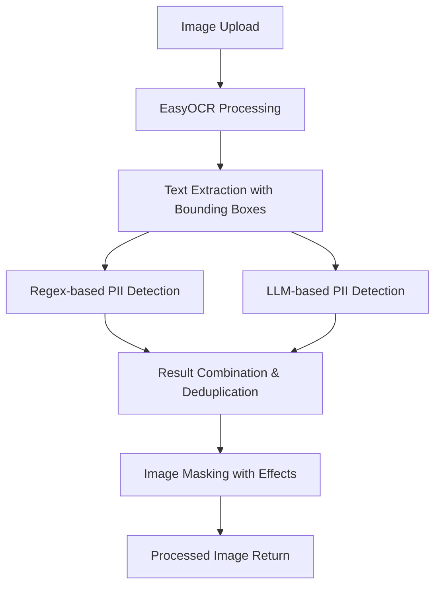

# PII Detection & Masking System

**A comprehensive full-stack application for automatically detecting and masking Personally Identifiable Information (PII) in images using AI and computer vision.**

## Overview

This project implements an intelligent PII detection and masking system that can automatically identify and redact sensitive information from document images such as Aadhaar cards, ID cards, passports, and other government documents. The system combines traditional computer vision techniques with modern LLM-based detection for maximum accuracy.

**Key Capabilities:**
- Detects names, addresses, phone numbers, email addresses, Aadhaar numbers, PAN numbers, dates of birth
- Multiple masking options (pixelation, blur, black boxes, colored overlays)
- Real-time processing with side-by-side comparison
- Multilingual support (English, Hindi, regional languages)
- Offline processing for privacy and security

---

## Tech Stack

### Backend (Python)
- **FastAPI** - High-performance web framework for building APIs
- **EasyOCR** - Optical Character Recognition for text extraction
- **Ollama** - Local LLM inference for intelligent PII detection
- **PIL (Pillow)** - Image processing and manipulation
- **Python Regex** - Pattern-based PII detection as fallback
- **Uvicorn** - ASGI server for FastAPI

### Frontend (React + TypeScript)
- **React 19** - Modern UI library with latest features
- **TypeScript** - Type-safe JavaScript for better development
- **Vite** - Fast build tool and development server
- **Tailwind CSS** - Utility-first CSS framework for responsive design

### AI/ML Models
- **Llama 3.2:3b** - Primary LLM for context-aware PII detection
- **Gemma 3n:e2b** - Alternative LLM model for comparison
- **EasyOCR Models** - Pre-trained OCR models for English and Hindi

---

## Architecture

### Processing Pipeline



### System Components

1. **OCR Layer** - Extracts text and coordinates from uploaded images
2. **Dual PII Detection** - Combines regex patterns with LLM intelligence
3. **Masking Engine** - Applies various visual effects to sensitive regions
4. **API Layer** - RESTful endpoints for frontend communication
5. **Frontend Interface** - Responsive UI for image upload and result visualization

---

## Features

### Core Functionality
- 🔍 **Advanced OCR** - Extract text from images with precise bounding boxes
- 🤖 **AI-Powered Detection** - Local LLM analysis for context-aware PII identification
- 🎨 **Multiple Masking Options** - Pixelation, blur, black boxes, colored overlays
- 🌐 **Multilingual Support** - Works with English, Hindi, and regional languages
- 🔒 **Privacy-First** - All processing happens locally, no data leaves your system
**Family Names** - Father's/Mother's names

---

## Installation

### Prerequisites
- Python 3.8+
- Node.js 18+
- Ollama (for LLM functionality)

### Backend Setup

1. **make virtual environment**
   ```bash
    python -m venv venv
    source venv/bin/activate
   ```

2. **Install Python dependencies**
   ```bash
   pip install -r requirements.txt
   ```

3. **Install and setup Ollama**
   ```bash
   # Install Ollama
   curl -fsSL https://ollama.com/install.sh | sh
   
   # Start Ollama service
   ollama serve
   
   # Download LLM models (choose one or both)
   ollama pull llama3.2:3b
   ollama pull gemma3n:e2b
   ```

4. **Start the backend server**
   ```bash
   uvicorn main:app --host 0.0.0.0 --port 8000
   ```
   Backend will be available at `http://localhost:8000`

### Frontend Setup

1. **Install dependencies**
   ```bash
   npm install
   ```

2. **Start development server**
   ```bash
   npm run dev
   ```
   Frontend will be available at `http://localhost:5173`

---

## Usage

### Basic Workflow

1. **Upload Image** - Drag and drop or click to upload an image containing PII
2. **Automatic Processing** - System extracts text and identifies PII automatically
3. **Choose Masking Style** - Select from pixelation, blur, black boxes, or colored overlays
4. **Review Results** - Compare original and masked images side-by-side
5. **Download** - Save the masked image with privacy protection applied

### Masking Options

| Option | Description | Use Case |
|--------|-------------|----------|
| 🎮 **Pixelate** | Retro pixelated effect | Modern, stylish masking |
| 🌀 **Blur** | Gaussian blur effect | Subtle, professional look |
| ⬛ **Black Box** | Solid black rectangles | Maximum privacy, traditional |
| 🔴 **Red Box** | Colored rectangle overlay | Highlighting sensitive areas |

---

## API Documentation

### Endpoints

#### Health Check
```http
GET /health
```
Returns system status and model availability.

**Response:**
```json
{
  "status": "ok",
  "ollama_available": true,
  "model": "llama3.2:3b"
}
```

#### Image Processing
```http
POST /upload?mask_type=pixelate
Content-Type: multipart/form-data
```

**Parameters:**
- `file` (required) - Image file (PNG, JPG, JPEG)
- `mask_type` (optional) - Masking style: `pixelate`, `blur`, `black`, `red`

**Response:** Processed image as PNG stream

---
# Mysore-Hackton
# Mysore-Hackton
